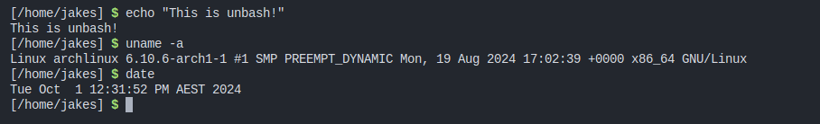

# Unbash
A custom UNIX shell.



This is a simple shell that I implemented in C, which can run programs, supports argument passing & line history/line editing, and can mostly be used as an actual shell. You can both use it as a shell, and use it to run shell scripts (with the file extension `.ub`).

Most importantly - **Unbash is it's own build system!** That's right, the compilation script for Unbash is an Unbash script.

Unbash has support for a startup script. Create the file `.unbashrc` in your home directory (`~/.unbashrc`), and put in it some unbash commands. These will be run each time that unbash is run.

## Building
Simply clone the repo and run the compilation script.
```bash
git clone https://github.com/UnmappedStack/unbash
cd unbash
unbash compile.ub
```
Oh sorry, you don't have unbash installed yet to be able to build it? You have a couple options:

- Download a pre-built release from the [releases tab](https://github.com/UnmappedStack/unbash/releases) (recommended)
- Just use bash to build it (unbash is fully compatible with bash)